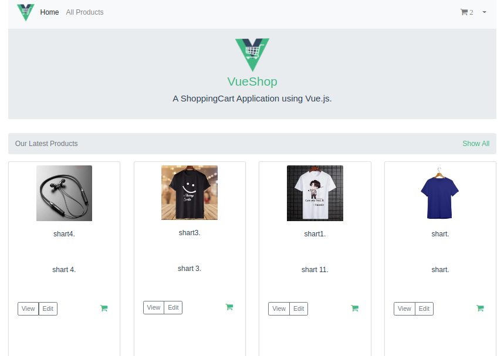
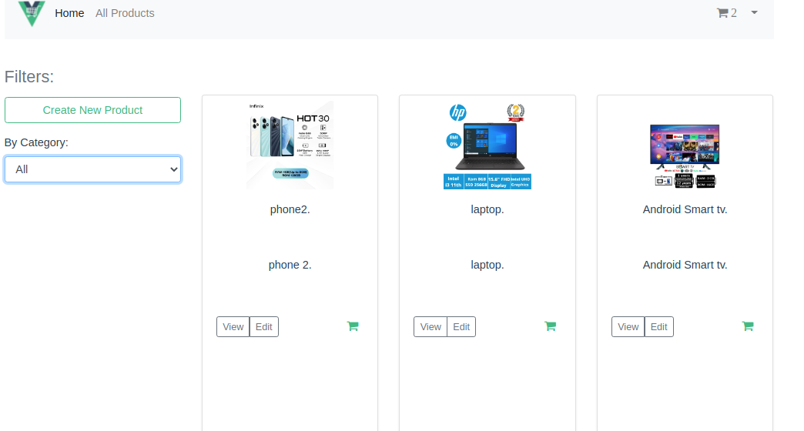
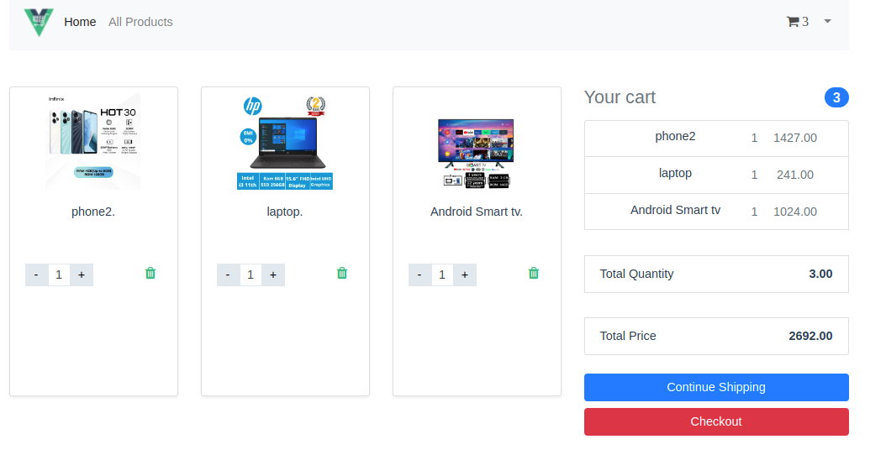
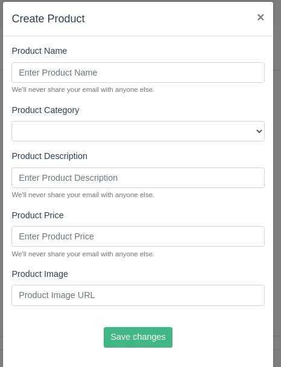
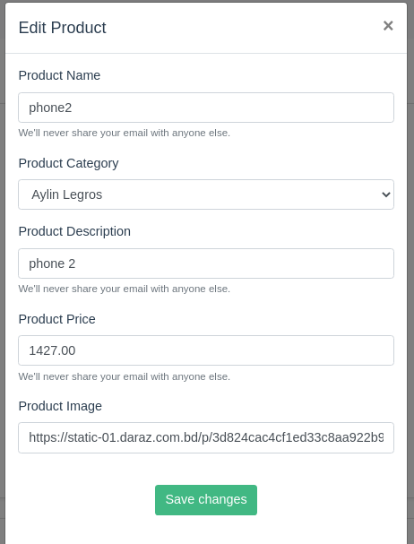
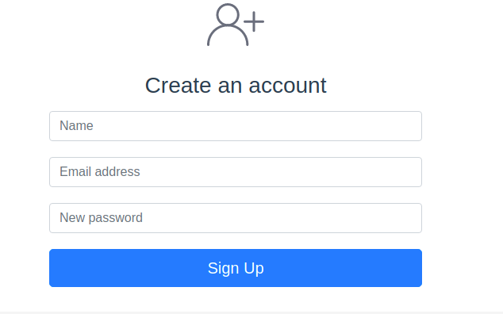
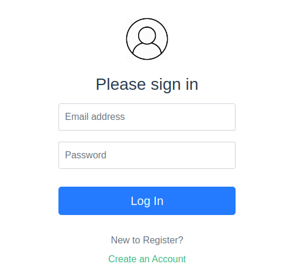

#  laravel-vue-shopping-cart

### Demo

#### Home Page

#### All Product Page

#### Cart Page

#### Create Product 

#### Edit Product 

#### Register User

#### Login User

### Tools & Tech stack used
- Laravel (back-end api)
- Laravel Sail (Backend Docker)
- VueJs (front-end)
- Vuex
- Bootstrap
- MySQL (Database)
- Docker (Frontend)

## Project installation instruction
### Laravel Backend
- Clone the repository
- Navigate to `/backend` folder
- Ensure docker is installed and active on host
- Copy .env.example: `cp .env.example .env` (relevant API keys are added in the `.env.example` for easier testing purpose)
- Install Php dependencies `docker run --rm --interactive --tty -v $(pwd):/app composer update`
- Start docker containers `./vendor/bin/sail up` (add `-d` to run detached)
- Setup app key: `./vendor/bin/sail php artisan key:generate`
- Migrate database: `./vendor/bin/sail php artisan migrate`
- Passport Install: `./vendor/bin/sail php artisan passport:install`
- Database Seeder `./vendor/bin/sail php artisan db:seed`

### Frontend
- Navigate to `/frontend` folder
- Build docker containers `docker compose build`
- Start docker containers `docker compose up` (add `-d` to run detached)
- Visit frontend: `http://localhost:8085`

### Login Admin
- Email: admin@gmail.com
- Password: 12345678
